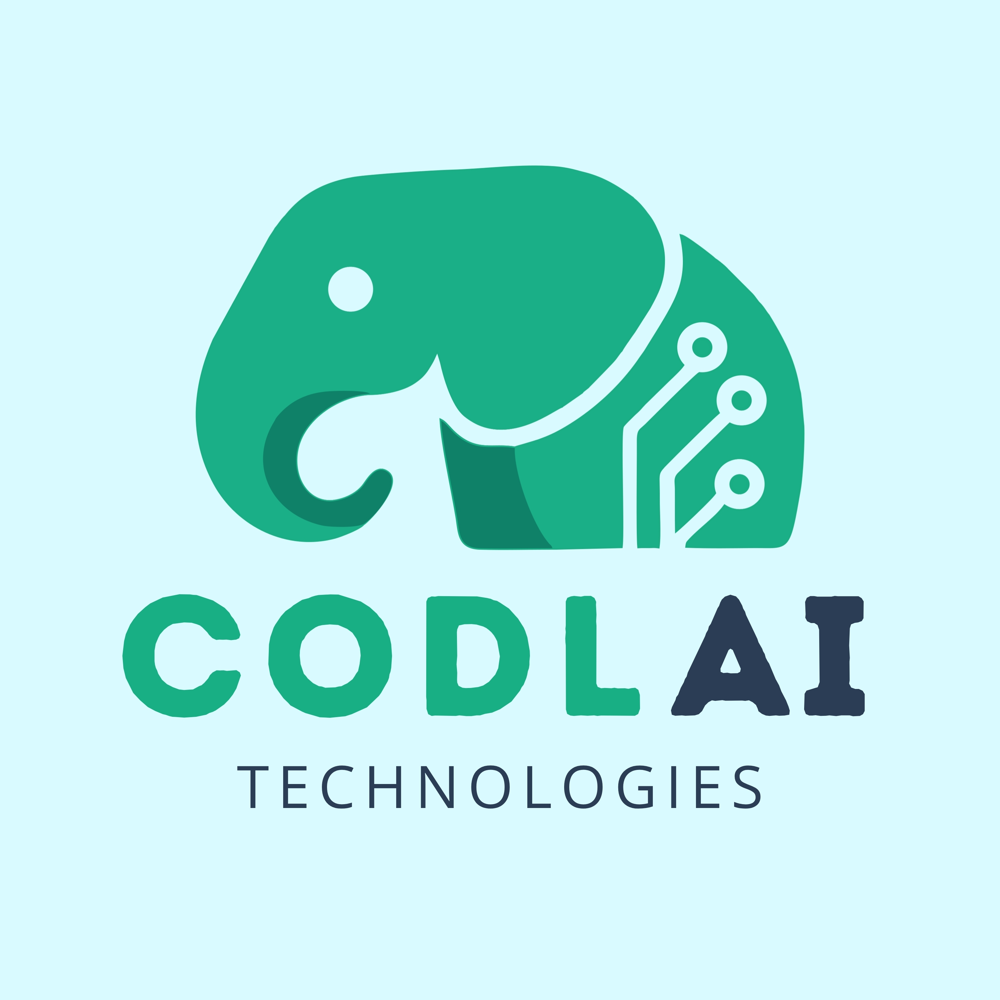

# CODLAI Technologies INC.

**"Robotic Coding for Everyone"**
*Herkes İçin Robotik Kodlama*

[Website](https://www.codlai.com) • [Editor](https://editor.codlai.com) • [Contact](mailto:info@codlai.com)

---

### 🇬🇧 About Us

Founded in 2021 as a master's thesis project to solve remote education challenges during the pandemic, **CODLAI Technologies** has evolved into a comprehensive education brand. We provide IoT-supported robots, functional compilers, and theoretical applications to offer innovative and practical training opportunities.

**🚀 What We Do:**
* **STEM Education Kits:** Modular sets tailored for all levels (ProSet, MiniSet, ProjeSet).
* **CODLAI Editor:** A powerful web & mobile IDE supporting Block-based coding, C++, and Python.
* **Programmable Robots:** Developing advanced hardware like CarBot, ArmBot, and DroneBot.
* **IoT & AI Solutions:** Bridging the gap between complex algorithms and real-world educational needs.

---

### 🇹🇷 Hakkımızda

Pandemi döneminde uzaktan robotik kodlama eğitimindeki zorluklara çözüm sunmak amacıyla 2021 yılında bir yüksek lisans tez projesi olarak doğan **CODLAI**, bugün uçtan uca bir eğitim teknolojileri markasıdır. Elektronik ürünlerimiz, özel derleyicimiz ve IoT destekli robotlarımızla yenilikçi, erişilebilir ve pratik eğitim fırsatları sunuyoruz.

**🚀 Neler Yapıyoruz?**
* **STEM Eğitim Setleri:** Her seviyeye uygun, müfredat destekli setler (ProSet, MiniSet, ProjeSet).
* **CODLAI Editör:** Blok tabanlı, C++ ve Python destekli; web ve mobilde çalışan kodlama platformu.
* **Programlanabilir Robotlar:** CarBot, ArmBot ve DroneBot gibi geliştirilebilir robotik çözümler.
* **IoT ve Yapay Zeka:** Nesnelerin interneti ve yapay zeka teknolojilerini eğitim dünyasına entegre ediyoruz.

---

### 🛠️ Tech Stack / Teknolojiler

`C++` `Python` `ESP-IDF` `IoT` `Artificial Intelligence` `Robotics` `Embedded Systems`

 

  
  📍 **Headquarters:** Sanayi Mah. Teknopark Bulvarı No:1/4C Pendik / İSTANBUL / TÜRKİYE
  
  © 2025 CODLAI Technologies INC. All rights reserved.

